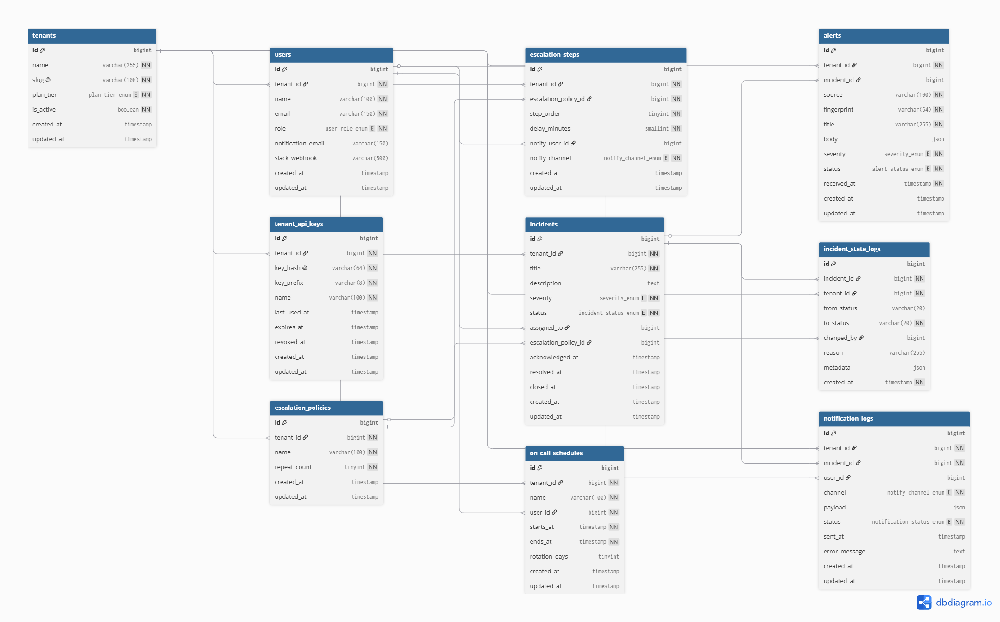

# Incident Management SaaS API


A production-grade, multi-tenant incident management backend — think PagerDuty/OpsGenie — built as a portfolio project to demonstrate real-world backend architecture: strict tenant isolation, queue-based ingestion that survives alert floods, a severity-gated state machine with an append-only audit trail, and a time-based escalation engine. Backend API only; no frontend.

## Database Schema

10 tables with foreign key relationships and composite indexes optimized for multi-tenant query patterns.



→ [View interactive schema on dbdiagram.io](https://dbdiagram.io/d/6a47fee44ac62e474c274234)

---

## Architecture Overview

```
 Monitoring tools (Datadog, Grafana, ...)
        │  POST /api/v1/alerts  (202 Accepted — returns immediately)
        ▼
 ┌─────────────────┐   alerts queue   ┌────────────────────────┐
 │ AlertController ├──────────────────► ProcessIncomingAlert   │
 └─────────────────┘                  │  · Redis dedup (5 min) │
                                      │  · creates Incident    │
                                      └───────────┬────────────┘
                                                  │ escalations queue
                                                  ▼
 ┌────────────────────┐  every minute  ┌──────────────────────┐
 │ incidents:escalate ├────────────────► EscalationEngine     │
 │    (scheduler)     │                │ · which step is due? │
 └────────────────────┘                └───────────┬──────────┘
                                                   │ notifications queue
                                                   ▼
                                       ┌──────────────────┐
                                       │ SendNotification │──► notification_logs
                                       └──────────────────┘
```

- **Multi-tenant isolation** — every model uses a `BelongsToTenant` global scope. The `ResolveTenant` middleware authenticates the SHA-256-hashed bearer key, binds the tenant into the container, and from that point every Eloquent query is automatically scoped. Cross-tenant lookups 404 at the route-binding layer; they never reach controller code.
- **Queue-based alert pipeline (the 202 pattern)** — ingestion does one lightweight insert and returns `202 Accepted`. Deduplication, incident creation, and notifications all happen in queue workers, so the API stays responsive under alert floods.
- **State machine with severity-gated transitions** — `open → acknowledged → resolved → closed`, enforced by `IncidentStateMachine`. P1/P2 incidents must be acknowledged before they can be resolved; P3/P4 may resolve directly. Every transition writes a row to the append-only `incident_state_logs` audit table inside the same DB transaction.
- **Redis deduplication and caching** — alert fingerprints (`SHA-256(tenant|source|title)`) are set with `SET NX EX 300`, collapsing repeats within a 5-minute window. The on-call resolver caches per-tenant for 60 seconds. Per-tenant rate-limit counters also live in Redis.
- **Two escalation mechanisms, by design** — an immediate on-call ping when an incident is first created, and a scheduler-driven ladder (`incidents:escalate`, every minute) that walks a policy's steps (each with its own delay and channel) with optional repeat loops until the incident is acknowledged.

## Tech Stack

| Layer | Choice |
|---|---|
| Framework | Laravel 12 (PHP 8.2) |
| Database | MySQL 8 |
| Cache / queues / dedup / rate limiting | Redis 7 (predis) |
| Background work | Laravel Queues (dedicated `alerts`, `escalations`, `notifications` queues) |
| Tests | Pest 3 |

## Key Design Decisions

- **Global scope over `where('tenant_id', ...)` discipline.** Tenant filtering that depends on every developer remembering a `where` clause eventually leaks. A boot-level global scope makes isolation the default and un-scoping the deliberate exception (system-wide sweeps like the escalation scheduler explicitly opt out and pass tenant ids around).
- **API keys are hashed, never stored.** Only `SHA-256(key)` is persisted; the plaintext is shown once at creation. A leaked database dump yields no usable credentials. Keys are individually revocable and support optional expiry.
- **`202 Accepted` + queues instead of synchronous processing.** An alert flood should never take down the ingestion endpoint. The controller's only job is validate → insert → enqueue; everything heavier is a worker's problem.
- **A state machine service instead of scattered status writes.** One service owns transitions, timestamps, and audit rows atomically — and it is the single place the severity gate lives. Invalid transitions throw; nothing else in the codebase writes `incidents.status`.
- **Redis `SET NX EX` for dedup instead of DB uniqueness.** Deduplication is a time-windowed concern, not a permanent constraint. An atomic Redis set with TTL gives one-round-trip dedup with automatic expiry and no cleanup jobs.
- **Append-only audit log.** `incident_state_logs` has no update path (no `updated_at`, `const UPDATED_AT = null`) — history cannot be rewritten, which is the point of an audit trail.

## Local Setup

**Requirements:** PHP 8.2+, Composer, MySQL 8, Redis 7 (on Windows: [Memurai](https://www.memurai.com/) works well).

```bash
git clone https://github.com/shaimaa-alanaswah/incident-management-api.git incident-management && cd incident-management
composer install
cp .env.example .env
php artisan key:generate
```

Create the database and a scoped user (adjust credentials to taste), then fill in `DB_*` in `.env`:

```sql
CREATE DATABASE incident_management CHARACTER SET utf8mb4 COLLATE utf8mb4_unicode_ci;
CREATE USER 'incident_mgmt'@'localhost' IDENTIFIED BY '<your-password>';
GRANT ALL PRIVILEGES ON incident_management.* TO 'incident_mgmt'@'localhost';
```

```bash
php artisan migrate
```

Run the API, workers, and scheduler (each in its own terminal):

```bash
php artisan serve                                                   # API
php artisan queue:work --queue=alerts,escalations,notifications    # queue workers
php artisan schedule:work                                           # fires incidents:escalate every minute
```

## Running Tests

Tests run against MySQL (the stats aggregations use `TIMESTAMPDIFF`, which SQLite doesn't have) on a **separate** database so dev data is never wiped. One-time setup:

```sql
CREATE DATABASE incident_management_test CHARACTER SET utf8mb4 COLLATE utf8mb4_unicode_ci;
GRANT ALL PRIVILEGES ON incident_management_test.* TO 'incident_mgmt'@'localhost';
```

Copy `.env` to `.env.testing`, set `APP_ENV=testing` and `DB_DATABASE=incident_management_test`, then:

```bash
php artisan test --env=testing
```

Redis must be running — the rate-limiting tests exercise the real Redis counters.

## API Reference

All endpoints are under `/api/v1` and require `Authorization: Bearer <api-key>`, with per-tenant rate limiting (free: 60/min, pro: 600/min, enterprise: 6000/min).

| Method | Path | Description |
|---|---|---|
| POST | `/alerts` | Ingest an alert — returns `202` immediately, processing is queued |
| GET | `/alerts` | List alerts (filter: `status`, `severity`, `source`; paginated) |
| GET | `/incidents` | List incidents (filter: `status`, `severity`; paginated) |
| GET | `/incidents/{id}` | Incident detail with full state history |
| PATCH | `/incidents/{id}/acknowledge` | Transition `open → acknowledged` |
| PATCH | `/incidents/{id}/resolve` | Transition to `resolved` (P1/P2 must be acknowledged first) |
| PATCH | `/incidents/{id}/close` | Transition `resolved → closed` |
| PATCH | `/incidents/{id}/assign-policy` | Attach/detach an escalation policy (`null` detaches) |
| GET | `/incidents/{id}/logs` | Append-only audit trail for the incident |
| GET | `/escalation-policies` | List escalation policies |
| POST | `/escalation-policies` | Create a policy with nested steps (one transaction) |
| GET | `/escalation-policies/{id}` | Policy detail with ordered steps |
| PUT | `/escalation-policies/{id}` | Update policy, replacing all steps |
| DELETE | `/escalation-policies/{id}` | Soft-delete (409 if referenced by an open/acknowledged incident) |
| GET | `/schedules` | List on-call shifts (`is_on_call` flag on each) |
| POST | `/schedules` | Create a shift (warns on overlap for the same user) |
| GET | `/schedules/oncall` | Who is on call right now (404 if nobody) |
| DELETE | `/schedules/{id}` | Delete a future shift (409 for active/past shifts) |
| GET | `/notifications` | Notification log (filter: `status`, `channel`, `incident_id`) |
| GET | `/stats/overview` | Incident counts by status + average MTTR |
| GET | `/stats/volume` | Alert volume over the last 7 days (`?groupBy=hour\|day`) |

Error semantics: `401` bad/missing/revoked/expired key or inactive tenant · `404` resource not found *or belongs to another tenant* · `409` conflicting state (policy in use, active shift) · `422` validation failure or invalid state transition · `429` rate limit exceeded (includes `retry_after`).

## Load Testing

```bash
php artisan simulate:alert-flood --tenant=1 --count=500
```

Options: `--count` (default 100), `--severity=P1..P4` (default: random per alert). Each simulated alert gets a unique fingerprint, so the flood measures pipeline throughput rather than dedup collapse.

What to observe:

- The command finishes almost instantly — it only inserts rows and enqueues jobs, mirroring how the HTTP endpoint stays fast under load.
- `php artisan queue:work --queue=alerts,escalations,notifications` — watch the workers drain the backlog; each alert becomes an incident, an escalation evaluation, and a notification.
- `tail -f storage/logs/laravel.log` — `Simulated notification sent to ...` lines confirm end-to-end delivery; `notification_logs` fills with `sent` rows.
- `GET /api/v1/stats/overview` and `/stats/volume` — counts update as the backlog drains.

## Roadmap
- [ ] Postman collection — ready-to-import API testing
- [ ] Real notification transport (Laravel Mail + Slack webhooks)
- [ ] POST /register — tenant self-registration endpoint
